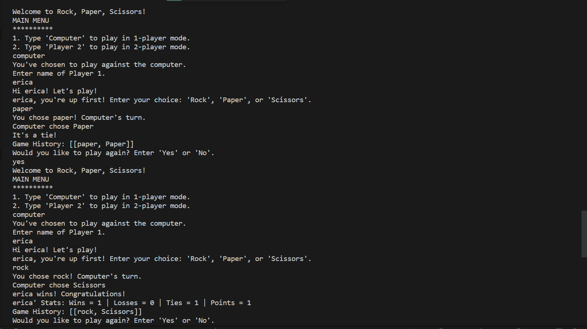

# Tic-Tac-Toe

An engaging implementation of the classic Rock, Paper, Scissors game, designed to be played directly in the terminal using Java. This project presents a simple yet enjoyable gaming experience, offering two distinct modes of play: a one-player mode, where you can challenge the computer's randomized choices, and a two-player mode, perfect for playing with a friend. 

## Introduction

### Rules

* Players are greeted with an introductory message and main menu where they can choose between 1-player and 2-player mode.

* Players' input is not case-sensitive but must be valid or they will receive an error message prompting them to try again and enter a valid choice.

* Players take turns choosing between 'Rock', 'Paper', and 'Scissors'.

* Player 1 makes the first move with their choice from the available options.

* Players' input is not case-sensitive but must be valid or they will receive an error message prompting them to try again and enter a valid choice.

* Players are shown a message displaying whose turn it is next (either 'Computer' or 'Player 2', depending on Player 1's choice from the main menu at the start of the game), unless there is a winner or a tie.

* Players cannot change moves after entering their choice.

* Rock beats scissors and loses to paper. Paper beats rock, but loses to scissors. Scissors beat paper but loses to rock.

* If both players happen to choose the same move, the game ends in a tie.

* Players will not be able to continue playing after a player wins or tie has been declared.

* Players can choose to start a new game if they wish to play again.

* Players can keep score throughout multiple rounds and view the number of wins, losses, and tied games for each player, along with a record of moves made by both players in each round.

## Author

:woman_technologist: Erica Ayala

* [LinkedIn](https://www.linkedin.com/in/ayalavirtual)

* [GitHub](https://www.github.com/AyalaVirtual) 

